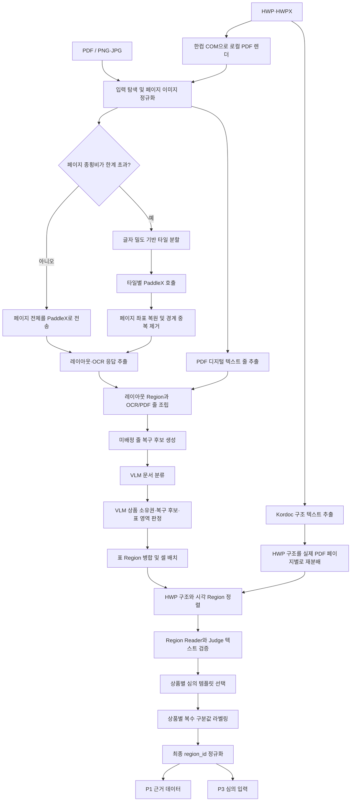

# nh-parser-fin 개발 인수인계 문서

> 이 문서는 `nh-parser-fin`을 처음 보는 개발자가 저장소의 목적, 입출력 계약, 실제 실행 경로,
> 파싱 단계별 판단 근거와 운영 시 주의점을 빠르게 파악할 수 있도록 작성한 인수인계 문서입니다.
> 구현 설명은 `run.py`에서 시작되는 현재 파이프라인을 기준으로 하며, 문서 작성 시 확인한 기반
> 커밋은 `663899e`입니다.
>
> **HWP/HWPX 개발 상태(2026-09-23):** 아래 HWP 입력 흐름은 아직 `main`에 병합되지 않은
> 개발 브랜치에서 구현·검증 중입니다. 요청 시 전달된 브랜치명은 `codex/hwp-input-rendering`이며,
> 이 문서를 수정한 현재 Git 상태에서는 같은 HWP 커밋이 `feat/hwp-input-render`
> (`origin/feat/hwp-input-render`)에 있습니다. GitHub에서 인수인계 ZIP을 만들 때 최종 브랜치명을
> 다시 확인해야 합니다. HWP 외 PDF·이미지 흐름은 기존 주 실행 경로입니다.

## 1. 프로젝트가 해결하는 문제

이 저장소는 농협 금융 광고물인 PDF, PNG/JPG, HWP/HWPX를 읽어 광고 심의 시스템이 사용할 수
있는 **영역(Region) 단위 JSON**으로 변환합니다.

단순히 이미지에서 글자만 추출하는 것이 목적은 아닙니다. 실제 광고물에는 다음 문제가 함께
있습니다.

- PDF 텍스트 레이어와 화면에 보이는 글자가 다를 수 있습니다.
- 긴 모바일 상세페이지는 한 번에 OCR하면 작은 글자가 지나치게 축소됩니다.
- PaddleX가 반환한 레이아웃 영역과 OCR 줄이 일치하지 않을 수 있습니다.
- 한 페이지에 여러 상품과 페이지 공통 문구가 함께 있을 수 있습니다.
- 표가 하나의 영역이 아니라 여러 작은 영역으로 분리될 수 있습니다.
- OCR이 디자인 글자, 작은 유의사항, 숫자와 기호를 잘못 읽을 수 있습니다.
- 심의 항목은 상품군과 광고 유형별 템플릿에 따라 달라집니다.

따라서 이 파이프라인은 글자 인식뿐 아니라 다음을 함께 처리합니다.

1. 모든 입력을 하나의 페이지 픽셀 좌표계로 정규화
2. 긴 페이지 분할과 원본 좌표 복원
3. PaddleX 레이아웃 영역과 OCR/PDF 텍스트 줄 조립
4. 어느 영역에도 들어가지 않은 텍스트 복구
5. 문서 분류와 상품별 영역 소유권 판정
6. 표 후보 병합과 셀 행·열 복원
7. HWP 입력의 구조 텍스트·셀을 시각 Region과 정렬
8. OCR/PDF/HWP 구조 텍스트와 VLM 전사의 교차 검증
9. 상품별 광고 템플릿 선택과 구분값 라벨링
10. 근거 보존용 P1과 심의 입력용 P3 생성

## 2. 결과물을 이해하는 핵심 개념

### 2.1 Region

Region은 심의에서 하나의 근거로 참조할 수 있는 페이지 내 영역입니다. 기본적으로 다음 정보를
가집니다.

- `region_id`: P1과 P3를 연결하는 영역 ID
- `bbox`: 렌더된 페이지 픽셀 기준 `[x1, y1, x2, y2]`
- `text` 또는 P3의 `selected_text`: 최종 선택된 영역 텍스트
- `product_id`: 이 영역이 속한 상품 또는 `page_common`, `unknown`
- `semantic_labels`: `가입대상`, `대출금리`, `유의사항`과 같은 구분값
- `kind`: 일반 텍스트 또는 표
- `needs_review`: 원문 대조가 필요한 파싱 품질 경고

Region은 문장 하나와 반드시 일치하지 않습니다. 한 시각 영역에 `가입대상`과 `가입금액`이
같이 있으면 영역을 억지로 쪼개지 않고 하나의 Region에 두 라벨을 모두 붙입니다.

### 2.2 P1과 P3

최종 결과는 목적이 다른 두 계약으로 나뉩니다.

| 구분 | 역할 | 포함 내용 |
|---|---|---|
| P1 | 감사·재현·원인 분석용 근거 원장 | OCR/PDF/HWP 구조/VLM 후보, 좌표 출처, 소유권 판정, 표 셀, 경고 사유, 원래 ID |
| P3 | 후속 광고 심의 단계의 간결한 입력 | 최종 ID, 상품, bbox, 최종 텍스트, 구분값, 표 요약, 검수 여부 |

P1과 P3의 같은 영역은 최종 `region_id`로 연결됩니다. P3만 보고 상세 판정 근거가 부족하면 같은
ID로 P1을 조회합니다.

### 2.3 좌표와 의미 판단의 책임 분리

이 프로젝트에서 가장 중요한 설계 원칙입니다.

- **좌표는 PaddleX 레이아웃 또는 OCR/PDF 텍스트 줄에서만 만듭니다.**
- **VLM은 제공된 ID를 선택하고 의미를 판정합니다.**
- VLM이 반환한 임의 좌표는 최종 Region 좌표로 사용하지 않습니다.
- 좌표가 없는 VLM 누락 문구는 `coarse_missing_candidates`로 P1에만 남기며 P3 영역으로
  승격하지 않습니다.

이 원칙이 있어야 심의 결과의 `region_ids`를 실제 원본 화면에 정확히 하이라이트할 수 있습니다.

## 3. 전체 파이프라인 한눈에 보기



실제 진입점은 `run.py`입니다. `--with-vlm`이 없으면 위 흐름 중 Region 조립까지 수행하고,
`--with-vlm`을 주면 문서 분류부터 P1/P3 생성까지 이어집니다.

## 4. 입력 계약

### 4.1 지원 형식

| 형식 | 현재 처리 방식 |
|---|---|
| PDF | 모든 페이지를 이미지로 렌더하고, 사용 가능한 디지털 텍스트 줄도 별도 추출 |
| PNG/JPG/JPEG | 파일 하나를 페이지 하나의 RGB 이미지로 처리 |
| HWP/HWPX | **개발 브랜치:** Kordoc으로 구조를 읽고, 설치형 한컴오피스로 실제 페이지를 PDF 렌더한 뒤 기존 PDF·PaddleX 경로와 결합 |

`--input`에는 파일과 폴더를 여러 개 지정할 수 있습니다. 폴더를 지정하면 **그 폴더 바로 아래의
지원 파일만** 읽으며 하위 폴더를 재귀 탐색하지 않습니다. `--exclude`는 파일명에 특정 문자열이
포함된 입력을 제외할 때 여러 번 지정할 수 있습니다.

```bash
uv run python run.py \
  --run-name handover-smoke \
  --with-vlm \
  --input "samples/sample.pdf" "samples/images" \
  --exclude "old"
```

### 4.2 페이지 크기 정책

기본 `--sizing asis`는 이미지의 원본 픽셀을 유지하고 PDF는 정해진 DPI로 렌더합니다.

- 일반적인 PDF는 200 DPI로 렌더합니다.
- `scan_like` 또는 `hybrid` PDF에 내장 래스터 이미지가 있으면 원본 정보량을 넘겨 확대하지
  않도록 계산한 native DPI를 사용합니다.
- `--sizing maxside --max-side 2500`을 주면 긴 변을 지정값 이하로 축소합니다.
- 확대는 하지 않습니다.

모든 후속 `bbox`는 실제로 PaddleX에 보낸 페이지 이미지의 픽셀 좌표입니다. 축소 모드를 썼다면
원본 파일의 물리 좌표가 아니라 축소된 `canvas` 좌표라는 점에 주의해야 합니다.

### 4.3 PDF triage와 디지털 텍스트

`ingest/triage.py`는 PDF 페이지의 텍스트 글자 수, 깨진 문자 비율, 이미지 면적비 등을 바탕으로
페이지를 `structured`, `scan_like`, `hybrid` 중 하나로 판정합니다.

현재 `run.py` 경로에서 이 판정은 다음에 사용됩니다.

- PDF 렌더 DPI 결정의 보조 신호
- `structured`와 `hybrid` 페이지의 디지털 텍스트 줄 추출 여부
- 페이지 생성 근거인 `origin.triage` 기록

중요하게도 triage 결과와 무관하게 **모든 페이지는 PaddleX를 거칩니다.** 디지털 텍스트는
PaddleX를 대체하는 별도 Region이 아니라 같은 페이지 좌표에 놓인 더 정확한 텍스트 후보입니다.

### 4.4 HWP/HWPX 처리 범위

이 절은 HWP 개발 브랜치의 **구현 중인 경로**를 설명합니다. 과거처럼 HWP의
내장 이미지 자산 하나를 가상 페이지 하나로 취급하지 않습니다. 현재
`ingest/loader.py::_hwp_pages()`는 서로 다른 두 근거를 만든 뒤 결합합니다.

1. `ingest/hwp_structure.py`가 Kordoc으로 문단, 표, 병합 셀, 중첩 표를 읽습니다. 이 결과는
   문자열과 문서 구조는 정확하지만 화면 좌표가 없습니다.
2. `ingest/hwp_render.py`가 Windows에 설치된 한컴오피스의 `HWPFrame.HwpObject` COM
   Automation으로 원본을 로컬 PDF로 저장합니다.
3. 변환 PDF는 일반 PDF와 같은 경로로 실제 페이지 이미지, 디지털 텍스트 bbox, triage 결과를
   만듭니다. 따라서 최종 bbox는 사용자가 보는 페이지와 같은 좌표계를 사용합니다.
4. Kordoc의 논리 `pageNumber`가 자동 쪽 나눔을 반영하지 않는 경우가 있어, 변환 PDF의 페이지별
   텍스트와 대조해 구조 노드를 실제 렌더 페이지에 다시 분배합니다.
5. 이후 PaddleX가 화면 Region과 이미지에만 있는 문구를 찾습니다. 표 배치 후 HWP 구조를
   Region에 정렬하고, 내용이 충분히 일치할 때만 HWP 문자열을 정본 후보로 채택합니다.

즉, **HWP 구조는 텍스트·셀 순서 근거**, **변환 PDF와 PaddleX는 페이지·bbox·시각 전용 문구
근거**를 담당합니다. 배경 이미지나 로고에만 있는 문구는 Kordoc 구조에 없어도 OCR/VLM
Region으로 회수할 수 있습니다. 구조 셀 하나가 여러 Region에 걸치면 한 Region의 텍스트를
억지로 덮어쓰지 않고 검증 근거로만 사용합니다.

현재 HWP 입력은 Kordoc 구조 파싱과 한컴 PDF 변환이 모두 성공해야 진행합니다. 둘 중 하나가
실패하면 HWP 문서 처리를 명시적으로 중단하며, 예전 내장 이미지 경로로 자동 폴백하지 않습니다.
상세 환경과 실측 내용은 [`docs/HWP_INPUT.md`](HWP_INPUT.md)를 참고하십시오.

## 5. 단계별 상세 로직

### 5.1 입력 탐색과 공통 캔버스 생성

관련 코드: `run.py`, `ingest/loader.py`, `ingest/canvas.py`, `ingest/triage.py`

`iter_inputs()`가 지원 확장자를 가진 입력을 모은 뒤 `load_pages()`가 각 파일을 `LabPage` 목록으로
변환합니다. `LabPage`에는 문서 ID, 원본 파일명, 페이지 번호, RGB 이미지와 생성 근거 `origin`이
들어 있습니다.

이 단계가 필요한 이유는 PDF pt 좌표, 이미지 픽셀, HWP 구조 텍스트처럼 서로 다른 입력 단위를 이후에
하나의 **페이지 픽셀 좌표계**로 통일하기 위해서입니다.

특히 PDF 렌더 결과는 라이브러리 버전에 따라 픽셀과 OCR 결과가 달라질 수 있으므로
`pypdfium2==5.12.0`으로 고정되어 있습니다.

### 5.2 긴 페이지 타일링

관련 코드: `ocr/tiling.py`, `ocr/bands.py`

PaddleX 레이아웃 모델은 입력을 내부적으로 정사각형에 맞추므로 매우 긴 페이지를 통째로 보내면
작은 글자와 작은 레이아웃 영역이 소실될 수 있습니다. 그래서 픽셀 수 자체가 아니라
`긴 변 / 짧은 변`인 왜곡 비율을 기준으로 분할합니다.

기본 동작은 다음과 같습니다.

- 왜곡 비율이 `PARSER_V2_ASPECT_LIMIT` 이하이면 통째로 전송
- 한계를 넘으면 긴 축을 따라 분할
- 목표 타일 길이는 `PARSER_V2_TILE_SPAN`이며 기본 1600px
- 글자 획 밀도가 비슷하게 담기도록 나누고 가능한 경우 빈 경계로 절단선을 이동
- 타일 사이에 15% 수준, 최소 80px·최대 200px의 오버랩 적용

단순 등간격이 아니라 글자 밀도를 쓰는 이유는 절단선이 글자 한가운데를 지나거나, 어떤 타일에는
글자가 지나치게 몰리는 문제를 줄이기 위해서입니다.

### 5.3 PaddleX PP-StructureV3 호출

관련 코드: `ocr/paddlex.py`, `run.py`

각 페이지 또는 타일을 JPEG/PNG로 인코딩해 `/layout-parsing` 엔드포인트에 base64로 전송합니다.
현재 `Profile.request_payload`는 `{"fileType": 1}`만 전달합니다. 레이아웃 threshold, bbox 병합,
표 인식 모듈 같은 실제 추론 설정은 PaddleX 서버의 파이프라인 YAML이 소유합니다.

응답에서는 세 종류의 관측을 사용합니다.

| PaddleX 응답 | 사용 목적 |
|---|---|
| `layout_det_res` | 원시 레이아웃 bbox, label, score 보존 |
| `parsing_res_list` | Region의 초기 bbox, 본문, 읽기 순서 생성 |
| `overall_ocr_res` | 텍스트 줄, 인식 점수, 줄 bbox 생성 |

`layout_det_res`는 진단 근거로 보존하지만 현재 Region 생성은 `parsing_res_list`를 기준으로 합니다.

PaddleX 호출에는 별도 재시도 래퍼가 없습니다. HTTP 오류나 비어 있는
`layoutParsingResults`가 발생하면 해당 실행이 중단됩니다.

### 5.4 타일 좌표 복원과 중복 제거

관련 코드: `ocr/tiling.py::shift()`, `ocr/tiling.py::dedupe()`,
`parse/adapters.py::dedupe_ocr_lines()`

타일 응답의 모든 bbox에 타일의 x/y 오프셋을 더해 페이지 좌표로 복원합니다. 그다음 서로 다른
타일의 오버랩 구간에서 중복 검출된 영역과 OCR 줄을 제거합니다.

- 레이아웃 영역은 같은 label과 높은 x/y 겹침을 기준으로 합집합 bbox를 만듭니다.
- OCR 줄은 문자열 일치가 아니라 IoU 또는 작은 박스 기준 포함비로 중복을 판단합니다.
- 더 높은 OCR 점수의 줄을 남깁니다.
- 제거한 다른 판독은 `tile_alternates`에 보존합니다.
- 같은 타일 안의 중첩 박스는 부모·자식 구조일 수 있으므로 제거하지 않습니다.

### 5.5 PDF 디지털 텍스트와 OCR 줄 통합

관련 코드: `run.py::_digital_lines()`, `ingest/triage.py::extract_digital_lines()`,
`parse/adapters.py::build_page_evidence()`

PDF 텍스트 좌표는 pt 단위이므로 렌더 DPI를 이용해 페이지 픽셀 좌표로 변환합니다. 표의 같은 행에
있는 다른 칸이 한 문장으로 붙지 않도록 비정상적으로 큰 가로 간격에서 디지털 줄을 분리합니다.

그다음 canonical line stream을 만듭니다.

1. 디지털 PDF 줄을 먼저 넣습니다.
2. 디지털 줄 bbox가 50% 이상 덮는 OCR 줄은 중복으로 보고 제외합니다.
3. 나머지 OCR 줄을 보충합니다.
4. 페이지 읽기 순서로 정렬하고 `pN_lNNNN` 형식의 `line_id`를 부여합니다.

디지털 텍스트를 우선하는 이유는 선택 가능한 PDF 원문이 일반 OCR보다 문자 정확도가 높은 경우가
많기 때문입니다. 동시에 OCR 원본은 `ocr_evidence`, 디지털 원본은 `digital_evidence`에 각각
남겨 두므로 둘의 차이를 추적할 수 있습니다.

### 5.6 PaddleX 영역과 텍스트 줄 조립

관련 코드: `parse/adapters.py`

`parsing_res_list`의 각 항목으로 초기 Region을 만들고, canonical line을 Region에 귀속합니다.

- OCR/PDF 줄 bbox 면적의 50% 이상이 Region과 겹쳐야 후보가 됩니다.
- 여러 Region과 겹치면 겹침 비율이 가장 높고, 같은 비율이면 면적이 더 작은 Region을 선택합니다.
- 줄 하나는 정확히 하나의 Region 또는 `unassigned_lines`에만 들어갑니다.
- 조립이 끝나면 모든 canonical `line_id`가 중복도 누락도 없는지 검사하고, 조건이 깨지면
  `ValueError`를 발생시킵니다.

Region의 초기 정본 텍스트는 다음 우선순위로 정합니다.

1. 디지털 줄이 있으면 줄 조립 텍스트
2. PaddleX `block_content`가 OCR 줄 일부를 빠뜨렸으면 줄 조립 텍스트
3. 두 조건에 해당하지 않고 `block_content`가 있으면 `block_content`
4. `block_content`가 비었으면 줄 조립 텍스트
5. 둘 다 없으면 빈 문자열

`block_content`와 줄 조립본은 공백을 제거한 뒤 유사도를 기록합니다.

- 0.8 이상: `sources_agree`
- 0.5 이상 0.8 미만: `minor_difference`
- 0.5 미만: `conflict_pending_vlm`

어느 후보가 선택되더라도 다른 후보는 `text_candidates`에 남습니다.

### 5.7 미배정 줄 복구 후보 생성

관련 코드: `parse/recovery.py`, `parse/pipeline.py::_prepare_page()`

PaddleX가 텍스트는 읽었지만 그 텍스트를 담는 레이아웃 Region을 만들지 못할 수 있습니다.
이 줄을 버리지 않고 bbox가 가까운 줄끼리 작은 덩어리로 묶어 `pN_xNNN` 복구 후보를 만듭니다.

- bbox는 원래 OCR/PDF 줄 bbox의 합집합만 사용합니다.
- 의미 판단은 이 단계에서 하지 않습니다.
- 세로 팽창을 작게 적용해 서로 다른 항목 행이 한 덩어리로 합쳐지는 것을 막습니다.
- 원본 미배정 줄은 `raw_unassigned_lines`에도 복사해 둡니다.

상품 소유권을 알기 전에 페이지 전체의 같은 높이 줄을 표로 합치지 않습니다. 좌우에 서로 다른
상품이 있는 페이지에서 두 상품의 표가 하나로 합쳐질 수 있기 때문입니다.

### 5.8 문서 분류

관련 코드: `vlm/client.py::classify()`

`--with-vlm` 실행 시 문서 첫 페이지 이미지로 다음을 문서당 한 번 판정합니다.

- `product_group`: 예금성, 대출성, 카드, 투자성 등
- `ad_type`: 상세페이지, 안내장, 배너, 이벤트페이지 등
- `product_name_shown`: 고유 상품명 노출 여부

파일명 키워드는 prior로 사용하지만 이미지에 명확한 반대 근거가 있으면 VLM 판단이 우선합니다.
P1에는 단순 결괏값뿐 아니라 `category_source`를 남겨 파일명과 VLM이 합의했는지, VLM이 파일명을
뒤집었는지, VLM 실패 후 파일명으로 폴백했는지 구분합니다.

분류 VLM 호출이 실패하면 파일명 prior를 안전 기본값으로 사용하고 파이프라인을 계속합니다.

### 5.9 페이지 상품 소유권과 복구 후보 판정

관련 코드: `parse/semantic.py::analyze_page_context()`,
`parse/pipeline.py::_apply_ownership()`

이 단계는 페이지 전체 문맥과 ID가 표시된 오버레이 이미지를 VLM에 주고 다음을 한 번에 받습니다.

- 페이지에 등장하는 상품 목록과 상품별 상품군·상품명 노출 여부
- 모든 기존 Region의 `product_id`
- 모든 복구 후보의 처리 방식
- 표처럼 보이는 영역의 구성 Region/Candidate ID
- 목록에는 없지만 화면에 보이는 누락 문구 후보

`product_id`의 의미는 다음과 같습니다.

| 값 | 의미 |
|---|---|
| `product_1`~`product_4` | 페이지 시각 순서에 따른 실제 상품 |
| `page_common` | 회사명, 로고, 심의번호, 연락처, 광고 전체 유의사항 |
| `unknown` | 특정 상품 소속인지 공통인지 확정하지 못함 |

복구 후보 action은 `new_region`, `attach_context`, `page_common`, `decorative`,
`needs_review` 중 하나입니다. 현재 구현은 **어떤 action이 와도 OCR/PDF 텍스트와 bbox를 삭제하지
않고 Region으로 보존**합니다. `decorative` 판정도 `vlm_excluded=true`로 표시할 뿐 삭제하지
않습니다. 모델의 장식 오판으로 실제 표 머리글 같은 텍스트가 사라지는 것을 막기 위한 정책입니다.

소유권 확신도가 0.7 미만이거나 `unknown`이면 `needs_review`와 상세 사유 코드가 붙습니다.

긴 페이지는 OCR 타일링 정보를 기준으로 2~4개 의미 밴드로 나눠 호출합니다. 각 ID는 bbox 중심에
따라 정확히 한 밴드에만 배정하고, 이미지 crop만 경계 문맥을 위해 겹칩니다. 일반 페이지는 전체
이미지 한 번으로 판정합니다.

소유권/복구 판정 호출은 공통 VLM 재시도 후에도 실패하면 현재 상위 파이프라인에서 복구하지 않아
실행이 중단됩니다.

### 5.10 표 후보 승격과 셀 배치

관련 코드: `parse/tables.py`, `parse/pipeline.py::_place_tables()`

표 후보는 다음 신호 중 하나로 찾습니다.

- 기존 Region이 이미 `kind=table`
- PaddleX 레이아웃 label이 `table`
- OCR 줄이 여러 행·열 격자 형태로 정렬됨
- 페이지 소유권 VLM이 여러 Region/Candidate ID를 하나의 `table_areas`로 지정

VLM이 지정한 `table_areas`를 병합할 때는 모델 좌표가 아니라 member ID가 가리키는 기존
OCR/PDF bbox를 사용합니다. 최소 3개 셀이 있어야 승격하며 같은 행에 인접한 누락 셀을 기하학으로
보충합니다.

다음 경우에는 병합하지 않습니다.

- VLM이 `field_list`로 판정한 항목명-값 나열
- 구성 Region의 상품 소유권이 둘 이상으로 갈리는 경우
- 표를 구성하기에 ID가 너무 적은 경우

병합 시 새 임시 표 ID를 만들지 않고 기존 구성원 중 PaddleX table Region 또는 가장 앞선 Region을
anchor로 사용합니다. 원래 구성원과 줄은 `merged_from`과 `lines`에 보존합니다.

실제 행·열 배치는 VLM에 페이지 전체 이미지, 표 확대 crop, 모든 `line_ref`와 crop 기준 좌표를
함께 줘서 받습니다. VLM은 텍스트나 bbox를 새로 만들지 않고 기존 줄을 row/col에 배치하는 역할만
합니다. 반환 결과는 다시 검증해 다음을 보존합니다.

- `grid.rows`, `grid.cols`
- 셀별 row, col, 원문, bbox, `line_refs`, header 여부
- 표 아래의 각주 `notes`
- 배치하지 못했거나 잘못 배치한 `unplaced_line_refs`
- VLM confidence와 분석 근거

표가 `complete`가 되려면 다음을 모두 만족해야 합니다.

1. 미배치 줄이 없음
2. confidence 0.7 이상
3. 채워진 셀 밀도 0.3 이상

하나라도 실패하면 `partial`이며 원문 줄 조립 텍스트를 최종 텍스트로 유지하고 품질 경고를
남깁니다. P3에는 `complete` 표만 실제 `rows` 행렬을 싣고, `partial` 표는 상태와 크기만
전달합니다.

### 5.11 HWP 구조와 시각 Region 정렬

관련 코드: `ingest/hwp_structure.py`, `parse/hwp_alignment.py`,
`parse/pipeline.py::run_full_pipeline()`

이 단계는 HWP/HWPX 페이지에만 실행되며, 상품 소유권과 VLM 표 배치를 마친 뒤 Region Reader보다
먼저 실행됩니다. 좌표 없는 Kordoc 노드와 bbox가 있는 시각 Region의 정규화 문자열, 순서,
포함 관계를 대조합니다.

- 문단은 직접 문자열 유사도와 문서 순서를 함께 사용해 Region에 연결합니다.
- 중간 문단의 직접 매칭이 약해도 앞뒤 문단이 같은 Region에 연결되면 순서 근거로 보완합니다.
- HWP 구조와 Region 텍스트가 충분히 일치하고 다른 Region의 문구를 침범하지 않을 때만
  `text_source=hwp_structure`로 정본을 교체합니다.
- 구조가 한 Region을 완전히 설명하지 못하면 기존 PDF/OCR 텍스트를 유지하고
  `hwp_structure_corroboration`에 동의 근거만 남깁니다.
- 큰 희소 병합표나 이미지 중심 1열 표는 조판용 `layout_container`로 보고 P3 표로 승격하지
  않습니다. 작고 모든 셀이 한 Region에서 확인된 `data_table_candidate`만 Kordoc 셀 순서를
  완전 표 근거로 사용할 수 있습니다.
- HWP의 연속 문단을 VLM이 억지 격자로 만든 경우에는 표 가설을 철회하고 본문 Region으로
  되돌립니다.

이 결합은 HWP 원문 문자열의 정확성과 실제 렌더 화면 좌표를 동시에 얻기 위해 필요합니다.
정렬할 구조 노드가 있는데 하나도 대응하지 않으면 `hwp_structure_page_unmatched` 경고를 남겨
페이지 분배나 렌더 차이를 사람이 확인할 수 있게 합니다.

### 5.12 영역별 Reader와 Judge

관련 코드: `parse/reading.py`

표가 아닌 각 Region을 VLM Reader가 독립적으로 다시 전사합니다. OCR 텍스트를 Reader에게 같이
보여 주지 않아 OCR 오류를 그대로 따라 쓰는 것을 줄입니다.

Reader 입력 crop은 다음과 같이 만듭니다.

- bbox 주위 12px 여백을 둡니다.
- 실제 bbox 밖의 이웃 내용은 흰색으로 가립니다.
- 작은 crop은 짧은 변 320px 이상이 되도록 최대 4배 확대합니다.

Reader 텍스트와 현재 parser 텍스트는 공백을 제거하고 `SequenceMatcher`로 비교합니다. 일치도가
0.95 미만이면 동일 crop과 두 후보를 Judge에게 주고 최종 전사를 선택하게 합니다. 한 자리 숫자나
금리 차이도 심의에서는 중요하므로 높은 일치 임계값을 사용합니다.

최종 텍스트 정책은 입력 근거에 따라 다릅니다.

- **디지털 PDF 텍스트가 있는 Region**: VLM이 달리 읽어도 parser 텍스트를 보존하고 불일치 경고만
  남깁니다.
- **이미지 OCR 기반 Region**: Judge가 있으면 Judge 결과를, Judge가 필요 없거나 실패하면 Reader
  결과를 최종 텍스트로 사용할 수 있습니다.
- **Reader가 빈 문자열을 반환**: 기존 OCR 텍스트를 지우지 않습니다.
- **Reader 호출 실패**: 해당 Region만 `vlm_read_failed`로 표시하고 페이지 처리는 계속합니다.

표 Region은 셀 배치 단계에서 이미 VLM이 crop을 봤으므로 Reader 대상에서 제외합니다.

`PARSER_V2_READING_SCOPE`로 범위를 바꿀 수 있습니다.

| 값 | 동작 |
|---|---|
| `all` | 표를 제외한 모든 bbox Region 판독, 기본값 |
| `targeted` | 짧은 텍스트, 후보 충돌, 줄 없는 영역 등 의심 영역만 판독 |
| `off` | 영역 Reader/Judge 비활성화 |

HWP 구조와 PDF 텍스트가 이미 같은 문자열을 확인한 Region은 VLM의 단독 오독으로 정본을 바꾸거나
불필요한 검수 대상으로 만들지 않습니다. 다만 한컴 전용 사설 영역(PUA) 글리프를 PDF/HWP가
표준 문자로 표현하지 못하고 VLM이 화면에서 정상 문자를 읽은 경우에는, 나머지 영숫자 문맥이
구조와 일치할 때 `vlm_structure_verified`로 제한적으로 정규화할 수 있습니다.

### 5.13 상품별 심의 템플릿 선택

관련 코드: `parse/templates.py`, `review/resolution.py`,
`templates/ad_templates.json`

카탈로그에는 예금성, 대출성, 카드, 투자성 광고에 대한 19개 템플릿이 들어 있습니다. 한 문서에
여러 상품이 있을 수 있으므로 템플릿은 문서당 하나가 아니라 **상품별로** 결정합니다.

처리 순서는 다음과 같습니다.

1. 문서 전체에서 같은 `product_id`의 Region을 모읍니다.
2. 소유권 단계의 상품별 상품군과 상품명 노출 여부를 확인합니다.
3. VLM이 보고한 상품명이 실제 해당 상품 Region 텍스트에 있는지 상호 검증합니다.
4. 상품군·상품명 노출 여부·본문 키워드로 결정론적 규칙을 먼저 적용합니다.
5. 후보가 여러 개로 남으면 후보와 광고 텍스트를 VLM에 주어 하나를 선택합니다.
6. 선택된 템플릿의 구분값 목록을 해당 상품의 허용 라벨로 사용합니다.

템플릿 VLM이 실패하거나 판단하지 못하면 `unresolved`로 남기며, 해당 Region은 임의 라벨을
붙이지 않고 `template_unresolved` 검수 대상으로 표시합니다.

`page_common`은 특정 상품의 템플릿을 바로 적용할 수 없습니다.

- 단일 상품 문서는 그 상품 템플릿의 라벨과 공통 라벨을 허용합니다.
- 여러 상품 문서는 19개 템플릿의 교집합 라벨만 허용합니다.
- `unknown` 영역은 문서에 등장한 상품 템플릿의 라벨 합집합과 공통 라벨을 허용하되, 별도 심의
  상품 단위로 만들지는 않습니다.

### 5.14 상품별 복수 구분값 라벨링

관련 코드: `parse/semantic.py::analyze_product_labels()`,
`parse/pipeline.py::_label_pages()`

페이지 안 Region을 `product_id`별로 나누고, 각 상품에는 그 상품의 템플릿이 허용하는 라벨만
enum으로 제공합니다. 여러 상품의 라벨을 한 요청에 섞지 않아 다른 템플릿 라벨이 잘못 붙는 것을
막습니다.

Region이 많으면 15개씩 나누어 호출합니다. VLM에는 페이지 전체 오버레이와 각 Region을 확대한
contact sheet를 함께 제공합니다. 한 Region에는 여러 라벨을 붙일 수 있습니다.

라벨은 다음 검증을 통과해야 합니다.

- 선택된 템플릿의 허용 라벨이어야 함
- 중복 라벨 제거
- VLM이 반환한 근거 quote가 실제 해당 Region 원문에 포함되어야 함
- reason이 `근거 없음`인데 라벨은 있는 식의 모순 응답 제거
- 짧은 title Region은 `상품명` 외 라벨이 번지지 않도록 제한

또한 `가입대상:`, `가입금액:`, `최고금리:`처럼 줄 시작에 명시된 표제어는 결정론 규칙으로 먼저
찾아 VLM 결과를 보완합니다. 문장 중간에 단어가 언급된 경우는 표제어로 보지 않습니다.

라벨이 없는 것 자체는 오류가 아닙니다. 광고 수식 문구나 장식 문구는 어떤 구분값에도 해당하지
않을 수 있습니다. 다만 현재 구현은 라벨 유무와 관계없이 해당 Region의 라벨 판정 confidence가
0.7 미만이면 품질 검수 대상으로 올립니다.

### 5.15 읽기 순서와 최종 Region ID 정규화

관련 코드: `parse/pipeline.py::_assign_reading_order()`, `parse/ids.py`

전체 bbox를 단순 y/x 정렬하면 2단 문서의 좌우 열이 섞일 수 있으므로 PaddleX 엔진 순서를
유지합니다. `attach_context`로 연결된 복구 Region만 대상 Region 바로 뒤에 배치하고, 상품별
`product_reading_order`도 별도로 기록합니다.

조립 중에는 출처에 따라 `pN_rNNN`, `pN_xNNN` 같은 ID를 사용합니다. 모든 소유권, 표, 텍스트,
라벨 판단이 끝난 후 현재 페이지 배열 순서대로 최종 ID를 다시 부여합니다.

```text
p1_r001, p1_r002, ...
p2_r001, p2_r002, ...
```

이때 bbox, 텍스트, 라벨, 배열 순서는 바꾸지 않습니다. `related_region_id`, `parent_id`,
`child_ids`, 표 member ID와 VLM 결정 내부 참조도 함께 갱신합니다. 원래 ID는 P1의
`source_region_id`와 페이지의 `region_id_map`에 남습니다.

### 5.16 P1/P3 내보내기

관련 코드: `parse/export.py`

P1 계약 버전은 `nh-ad-parse-evidence-v3`, P3 계약 버전은
`nh-ad-region-review-input-v7`입니다.

P3 Region의 기본 형태는 다음과 같습니다.

```json
{
  "region_id": "p1_r020",
  "product_id": "product_1",
  "bbox": [243, 518, 1570, 708],
  "selected_text": "가입대상: 개인 및 개인사업자",
  "labels": ["가입대상"],
  "kind": "text",
  "needs_review": false,
  "text_source": "vlm"
}
```

P3의 `text_source`는 세부 구현 이름을 그대로 노출하지 않고 `hwp`, `digital`, `ocr`, `vlm` 중
하나로 축약합니다. HWP 구조 문자열을 직접 정본으로 쓴 경우는 `hwp`, 변환 PDF 텍스트층을
유지한 경우는 `digital`입니다. 후보, 일치도, 선택 이유는 P1에서 확인합니다.

`needs_review`는 광고 심의의 위반 여부가 아니라 **파싱 품질 신호**입니다. 실제 심의 결과 계약은
별도로 다음을 요구합니다.

- `result`: `위반`, `판정불가`, `충족` 중 하나
- `reason`: 판정 사유
- `region_ids`: P3에 실제 존재하는 근거 Region ID 목록

## 6. 실행 산출물 구조

### 6.1 VLM 없이 실행한 경우

```text
outputs/<run-name>/
├─ manifest.json             실행 프로필, 입력 수, 페이지 수, 총 시간
├─ documents.json            OCR/PDF Region 조립 전체 결과
├─ raw/
│  └─ <문서>__pNNN_tNN.json  타일별 PaddleX prunedResult
├─ boxes/
│  └─ <문서>__pNNN.json      페이지 좌표로 복원된 parsing/OCR/PDF 줄
├─ pages/
│  └─ <문서>__pNNN.json      페이지별 canonical Region 증거
├─ label-studio.json         원시/정본/미배정 영역 시각 검수 작업
└─ labeling-config.xml       Label Studio 라벨 설정
```

렌더된 페이지 PNG는 기본적으로 저장소 루트의 `.media/`에 별도 저장됩니다. 여러 실행이 같은
페이지 이미지를 참조할 수 있도록 실행 디렉터리와 분리되어 있습니다.

### 6.2 `--with-vlm`으로 실행한 경우

위 파일에 다음이 추가되거나 확장됩니다.

```text
outputs/<run-name>/
├─ 03-ownership.json         상품 소유권, 템플릿, review unit 축약본
├─ 04-vlm-evidence.json      분류·Reader/Judge·표·라벨 VLM 판정 축약본
├─ 05-p1.json                모든 문서의 P1 배열
├─ 06-p3.json                모든 문서의 P3 배열
├─ vlm-stats.json            schema별 호출·재시도·타임아웃·시간 통계
└─ final/
   ├─ <문서명>.p1.json       문서별 P1
   └─ <문서명>.p3.json       문서별 P3
```

`label-studio.json`에는 최종 P3 semantic 영역 탭이 추가됩니다.

### 6.3 어떤 파일을 우선 확인해야 하는가

- 후속 심의 시스템 연동: `06-p3.json` 또는 문서별 `final/*.p3.json`
- 특정 Region의 원인 분석: 같은 문서의 `*.p1.json`
- OCR 서버 원응답 확인: `raw/*.json`
- Region 조립을 PaddleX 재호출 없이 재현: `boxes/*.json`
- 실행 조건과 비용 확인: `manifest.json`, `vlm-stats.json`
- 사람이 화면과 결과를 대조: `label-studio.json` 또는 `report.py`로 만든 HTML

## 7. 실행 방법

### 7.1 설치

Python 3.13을 기준으로 합니다.

```bash
uv sync --dev
```

`uv`를 사용하지 않으면 다음처럼 설치할 수 있습니다.

```bash
python -m pip install -e .
python -m pip install pytest
```

HWP/HWPX 입력은 현재 HWP 개발 브랜치에서 다음 로컬 실행 환경이 추가로
필요합니다.

- Windows와 설치형 한컴오피스(`HWPFrame.HwpObject` COM Automation 사용 가능 상태)
- Node.js/npm과 Kordoc 4.14.1. 기본 명령은 `npx --yes kordoc@4.14.1`이며 운영에서는 네트워크에
  의존하지 않는 고정 설치 경로를 권장합니다.
- 무인 실행이나 파일 접근 경고를 처리하기 위한 한컴 공식 Automation 보안 승인 모듈

이 의존성이 없어도 PDF와 이미지 입력은 실행됩니다. HWP 입력만 구조 파싱 또는 렌더 단계에서
명시적으로 실패합니다.

### 7.2 환경 설정

```bash
cp .env.example .env
```

주요 환경변수는 다음과 같습니다.

| 변수 | 필수 여부 | 현재 코드에서의 역할 |
|---|---|---|
| `PADDLEX_URL` | 필수 | PP-StructureV3 `/layout-parsing` 주소 |
| `PADDLEX_TIMEOUT` | 선택 | PaddleX 요청 timeout, 기본 300초 |
| `GEMMA_URL` | VLM 실행 시 필수 | OpenAI 호환 `chat/completions` 주소 |
| `GEMMA_MODEL` | VLM 실행 시 필수 | 서버에 배포된 모델명 |
| `GEMMA_TIMEOUT_S` | 선택 | VLM 1회 시도 timeout, 기본 120초 |
| `PARSER_V2_ASPECT_LIMIT` | 선택 | 타일링을 시작할 종횡비 한계, 기본 2.0 |
| `PARSER_V2_TILE_SPAN` | 선택 | 타일 목표 길이, 기본 1600px |
| `PARSER_V2_ENCODE` | 선택 | PaddleX 전송 이미지 형식, `jpeg` 또는 `png` |
| `PARSER_V2_READING_SCOPE` | 선택 | Region Reader 범위, `all`/`targeted`/`off` |
| `KORDOC_COMMAND` | HWP 선택 | Kordoc 실행 명령, 기본 `npx --yes kordoc@4.14.1` |
| `KORDOC_VERSION` | HWP 선택 | P1 provenance에 기록할 Kordoc 버전, 기본 `4.14.1` |
| `KORDOC_TIMEOUT` | HWP 선택 | 구조 파싱 timeout, 기본 180초 |
| `HWP_AUTOMATION_SECURITY_MODULE` | HWP 운영 권장 | 한컴 Automation 보안 승인 DLL 경로 |
| `HWP_RENDER_TIMEOUT` | HWP 선택 | HWP→PDF 변환 timeout, 기본 300초 |
| `HWP_RENDER_DIR` | HWP 선택 | 변환 PDF 보존 디렉터리. 없으면 임시 디렉터리 사용 |
| `NH_OUTPUT_ROOT` | 선택 | 실행 결과 루트, 기본 `./outputs` |
| `NH_MEDIA_DIR` | 선택 | 렌더 페이지 이미지 루트, 기본 `./.media` |
| `VLM_CACHE` | 개발용 | `r`은 기록/재사용, `p`는 캐시 미스 시 실패하는 재생 전용 |
| `VLM_CACHE_DIR` | 개발용 | VLM 캐시 경로, 기본 `.vlm_cache` |

환경변수는 프로세스에 이미 설정된 값이 우선하며, 없을 때 현재 디렉터리에서 상위로 탐색한
`.env` 값을 채웁니다.

> 주의: 현재 코드 기준 VLM 캐시 의미는 `r=record`, `p=replay-only`입니다.
> 기존 `.env.example`의 캐시 설명과 반대로 읽힐 수 있으므로 실제 동작은
> `vlm/cache.py::replay_only()`와 `vlm/client.py::chat_json()`을 기준으로 판단해야 합니다.

PaddleX가 원격 서버의 loopback 포트에만 열려 있으면 로컬 터널을 유지합니다.

```bash
ssh -N -L 18081:127.0.0.1:8081 spark-1118
```

### 7.3 OCR/Region 조립까지만 실행

```bash
uv run python run.py \
  --run-name ocr-check \
  --input "samples/sample.pdf"
```

### 7.4 전체 VLM 파이프라인 실행

```bash
uv run python run.py \
  --run-name full-check \
  --with-vlm \
  --input "samples/sample.pdf"
```

### 7.5 PaddleX 재호출 없이 Region 조립 재실행

```bash
uv run python replay.py \
  --from ocr-check \
  --run-name replay-check
```

`replay.py`는 이전 실행의 `boxes/`를 읽어 `build_page_evidence()`만 다시 수행합니다. PaddleX와
VLM을 호출하지 않으므로 줄 소유권, 텍스트 후보 선택, Region 조립 규칙을 빠르게 수정·검증할 때
사용합니다.

현재 `boxes/*.json`에는 HWP 구조 원본이 포함되지 않으므로 이 재생 경로만으로는 HWP 구조 정렬까지
완전히 재현할 수 없습니다. HWP 정렬을 포함한 재현에는 원본 HWP를 다시 실행하거나 P1의 구조
근거를 사용해야 합니다. 이는 개발 브랜치에서 남아 있는 재현성 보완 항목입니다.

결과는 다음 두 파일입니다.

- `outputs/replay-check/replayed-pages.json`
- `outputs/replay-check/replay-summary.json`

### 7.6 요약과 HTML 리포트

OCR 단계의 미배정 줄과 충돌이 많은 페이지를 우선순위로 정리할 수 있습니다.

```bash
uv run python -m nh_parser_fin.parse.summarize outputs/ocr-check
```

전체 VLM 실행 후 P3와 원본 bbox를 나란히 보는 자체 포함 HTML 리포트를 만들 수 있습니다.

```bash
uv run python report.py --run-name full-check
```

기본 출력은 `outputs/full-check/report.html`입니다.

## 8. VLM 호출 구조와 실패 처리

모든 VLM 작업은 `vlm/client.py::chat_json()`을 사용합니다.

- OpenAI 호환 `chat/completions` 호출
- `temperature=0`
- strict JSON Schema 응답 강제
- 기본 1회 + 재시도 2회, 총 3회 시도
- 재시도 사이 2초, 4초 대기
- 잘린 JSON으로 보이면 다음 시도의 `max_tokens`를 최대 16,000까지 증가
- schema별 호출 수, 캐시 수, 시도 수, timeout 수, 누적 시간 기록

VLM 호출 수는 고정되어 있지 않습니다. 대략 다음의 합입니다.

```text
문서 분류 수
+ 페이지 또는 긴 페이지 의미 밴드 수
+ 표 후보 수
+ Reader 대상 Region 수
+ OCR/Reader 불일치 Judge 수
+ 템플릿 규칙으로 확정하지 못한 상품 수
+ 상품별 라벨링 chunk 수
```

단계별 실패 정책은 서로 다릅니다.

| 단계 | 공통 재시도 후에도 실패했을 때 |
|---|---|
| 문서 분류 | 파일명 prior로 폴백하고 계속 |
| 페이지 소유권 | 현재 실행 중단 |
| 표 셀 배치 | 현재 실행 중단 |
| Region Reader/Judge | 해당 Region에 경고를 남기고 계속 |
| 템플릿 선택 | `unresolved`로 남기고 계속 |
| 상품별 라벨링 | 현재 실행 중단 |

따라서 운영 재실행 정책을 만들 때는 `vlm-stats.json`, 마지막 생성 산출물, 캐시 사용 여부를 함께
확인해야 합니다.

## 9. 저장소 구조와 모듈 책임

```text
run.py                         현재 전체 실행 진입점
replay.py                      boxes 기반 Region 조립 재실행
report.py                      P3와 페이지 이미지를 묶은 HTML 리포트 생성
README.md                      설치·실행·계약 요약
docs/
├─ PIPELINE.md                 짧은 단계별 설계 설명
├─ HWP_INPUT.md                개발 중 HWP 렌더·구조 결합 경로와 실행 환경
└─ HANDOVER.md                 이 인수인계 문서
nh_parser_fin/
├─ config.py                   외부 주소, 임계값, 실행 Profile, 출력 경로
├─ ir.py                       Pydantic 중간 표현 모델과 스타일/표 근거 타입
├─ ingest/
│  ├─ loader.py                현재 입력 탐색과 페이지 이미지 생성
│  ├─ canvas.py                RGB 변환, PDF 렌더, native DPI 계산
│  ├─ triage.py                PDF 판정, 디지털 텍스트·스타일·좌표 추출
│  ├─ hwp_render.py            한컴 COM 기반 HWP/HWPX→로컬 PDF 렌더
│  ├─ hwp_structure.py         Kordoc 구조 정규화와 실제 렌더 페이지 재분배
│  ├─ assets.py                이전 HWP 내장 이미지 보조 코드, 현재 주 경로 비연결
│  ├─ hwp.py                   이전 document-processor 구조 파서, 현재 run.py 비연결
│  └─ text_style.py            디지털 텍스트 스타일 대표값 계산
├─ ocr/
│  ├─ paddlex.py               PaddleX HTTP 호출과 응답 어댑터
│  ├─ tiling.py                현재 종횡비 기반 통짜/타일 결정과 좌표 복원
│  ├─ bands.py                 글자 밀도 프로파일과 절단선 계산
│  ├─ reading_order.py         이전 높이 기준 타일/Line 유틸, 현재 run.py 비연결
│  └─ view.py                  Label Studio bbox와 설정 생성
├─ parse/
│  ├─ adapters.py              레이아웃+OCR/PDF 줄을 canonical Region으로 조립
│  ├─ recovery.py              미배정 줄 복구 후보 생성
│  ├─ semantic.py              상품 소유권과 상품별 복수 라벨 VLM 판정
│  ├─ tables.py                표 후보, Region 병합, VLM 셀 배치와 검증
│  ├─ hwp_alignment.py         좌표 없는 HWP 구조와 시각 Region 정렬
│  ├─ reading.py               Region Reader/Judge와 최종 텍스트 선택
│  ├─ templates.py             상품별 템플릿·허용 라벨·review unit 구성
│  ├─ ids.py                   최종 Region ID 정규화와 참조 갱신
│  ├─ quality.py               needs_review 및 사유 코드 기록
│  ├─ export.py                P1/P3 계약 생성
│  ├─ pipeline.py              VLM 이후 전체 오케스트레이션
│  └─ summarize.py             OCR 조립 결과 우선 검수 페이지 요약
├─ review/
│  ├─ catalog.py               템플릿 JSON 로드와 무결성 검증
│  └─ resolution.py            규칙 우선, 필요 시 VLM 템플릿 선택
├─ templates/
│  └─ ad_templates.json        19개 금융광고 템플릿과 구분값·예시
└─ vlm/
   ├─ client.py                strict JSON VLM 공통 클라이언트와 문서 분류
   └─ cache.py                 개발용 결정론 캐시
tests/                         외부 서버 없이 실행하는 핵심 계약 단위 테스트
```

### 9.1 현재 주 실행 경로가 아닌 코드

저장소에는 이전 실험과 공유 모델을 위한 코드도 남아 있습니다. 인수인계 시 “파일이 있으니 현재
실행된다”고 오해하지 않도록 구분해야 합니다.

- `ingest/hwp.py::ingest_hwp()`와 `ingest/assets.py`의 예전 `document-processor` 경로는 현재
  `run.py`가 호출하지 않습니다. 개발 브랜치의 실제 HWP 경로는 `ingest/hwp_structure.py`와
  `ingest/hwp_render.py`입니다.
- `ocr/reading_order.py::make_tiles()` 대신 현재는 `ocr/tiling.py::plan()`을 사용합니다.
- `ocr/paddlex.py::build_payload()`의 많은 선택 옵션 대신 현재 `Profile.request_payload`의
  `{"fileType": 1}`만 사용합니다.
- `parse/tables.py::table_candidates()`는 현재 주 경로에서 직접 호출되지 않습니다. 미배정 줄은
  먼저 일반 복구 후보가 되고 VLM의 `table_areas` ID 판정을 통해 표로 승격됩니다.
- `ir.py` 모델 전체가 최종 `run.py` 데이터 흐름을 강제하는 것은 아닙니다. 현재 주요 파이프라인은
  dict 기반 조립이며, `Line` 등 일부 타입은 PDF 추출과 보조 경로에서 사용됩니다.

## 10. 품질 경고를 해석하는 방법

P3의 `needs_review=true`는 광고 내용이 위반이라는 뜻이 아닙니다. 파싱 결과를 사람이 원본과
대조해야 한다는 뜻입니다. 상세 사유는 P1의 같은 Region `review_reasons`에서 봅니다.

대표 사유는 다음과 같습니다.

| 사유 | 의미 |
|---|---|
| `ownership_low_confidence` | 상품 소유권 confidence가 0.7 미만 |
| `ownership_unknown` | 상품 또는 페이지 공통 소속을 확정하지 못함 |
| `recovery_action_uncertain` | 복구 후보 처리 action이 `needs_review` |
| `recovery_low_confidence` | 복구 후보 판정 confidence가 0.7 미만 |
| `table_unplaced_lines` | 일부 원문 줄을 표 셀에 배치하지 못함 |
| `table_low_confidence` | 표 구조 confidence가 0.7 미만 |
| `table_sparse_grid` | 선언된 격자 대비 채워진 셀 비율이 낮음 |
| `digital_text_vlm_disagreement` | PDF 원문과 VLM 판독이 다르며 PDF 원문을 보존함 |
| `ocr_vlm_disagreement` | OCR과 Reader가 다르고 확정 Judge가 없음 |
| `vlm_judge_low_confidence` | Judge 최종 선택 confidence가 0.7 미만 |
| `vlm_only_text` | 기존 OCR 텍스트 없이 VLM 판독만 있음 |
| `vlm_read_failed` | 해당 Region Reader 호출 실패 |
| `hwp_structure_page_unmatched` | HWP 구조 노드가 있지만 현재 렌더 페이지의 어떤 Region과도 대응하지 않음 |
| `template_unresolved` | 상품 템플릿을 확정하지 못해 라벨링 보류 |
| `label_low_confidence` | 라벨 판정 confidence가 0.7 미만 |

검수 순서는 다음을 권장합니다.

1. `ownership_unknown`, `template_unresolved`: 잘못된 상품/템플릿은 다수 라벨에 연쇄 영향
2. `digital_text_vlm_disagreement`, `ocr_vlm_disagreement`: 숫자·금리·날짜 우선 확인
3. `table_*`: 완전 표 여부와 셀 행·열 확인
4. `label_low_confidence`: Region 원문과 템플릿 구분값 비교

## 11. 테스트와 변경 후 검증

### 11.1 단위 테스트

```bash
uv run pytest -q
```

테스트는 외부 PaddleX/VLM 서버를 호출하지 않고 다음 계약을 검증합니다.

- canonical line이 정확히 한 Region 또는 unassigned에만 속함
- PDF 디지털 텍스트 우선과 후보 보존
- 타일 경계 OCR 중복 제거
- 복구 후보 bbox가 원문 줄 합집합으로 유지됨
- 긴 페이지 의미 밴드에 모든 ID가 정확히 한 번 배정됨
- Reader/Judge 선택과 디지털 텍스트 보존
- HWP 구조 페이지 재분배와 구조↔Region 정렬
- HWP 구조 정본 선택, 조판 표 제외, 검증된 데이터 표 승격, PUA 글리프 정규화
- 표 후보 병합, 셀 중복/누락/각주/부분 표 처리
- 상품별 템플릿 분리와 페이지 공통 라벨 정책
- 복수 라벨과 원문 quote 검증
- 최종 ID 형식과 모든 연결 참조 갱신
- P1/P3 최소 계약

### 11.2 실제 서비스 포함 smoke test

단위 테스트는 외부 서비스 계약을 검증하지 않으므로 배포 전 작은 대표 파일로 다음을 확인해야
합니다.

1. PaddleX 터널과 `/layout-parsing` 응답 정상 여부
2. Gemma endpoint가 strict `json_schema`를 지원하는지
3. `manifest.json`의 `request_payload`와 sizing 값
4. `documents.json`의 Region 수, 미배정 줄, 충돌 수
5. `vlm-stats.json`의 timeout과 비정상 재시도 증가 여부
6. P1/P3 같은 `region_id`의 bbox와 텍스트 일치
7. HTML 또는 Label Studio에서 실제 위치 하이라이트
8. HWP 검증 시 한컴 렌더 페이지 수와 `origin.structure_page_count` 차이 확인
9. HWP P1의 `hwp_structure`, `hwp_alignment`, Region별 구조 검증 근거 확인
10. 배경 이미지 문구 회수와 조판용 표가 P3 데이터 표로 잘못 승격되지 않았는지 확인

## 12. 유지보수 시 변경 지점

### 12.1 새 입력 형식 추가

`ingest/loader.py`의 `SUPPORTED`, `iter_inputs()`, `load_pages()`에 새 형식을 연결하고 최종적으로
`LabPage(image=RGB 이미지, page_no, origin)`를 반환해야 합니다. 좌표계가 바뀌는 변환은 반드시
`origin`에 크기와 scale을 기록해야 합니다.

### 12.2 타일링 정책 변경

`ocr/tiling.py`와 `ocr/bands.py`를 수정합니다. 단순 Region 수만 비교하지 말고 다음을 함께
측정해야 합니다.

- OCR 줄 수와 글자 회수율
- 타일 경계 중복 수
- 미배정 줄 수
- 작은 금리/유의사항 문구 회수
- 전체 PaddleX 호출 수와 시간

### 12.3 PaddleX 추론 옵션 변경

현재 운영 원칙은 서버 YAML이 옵션을 소유하는 것입니다. 코드에서 HTTP payload를 늘리면 서버의
클래스별 설정이나 모듈 on/off를 덮어쓸 수 있으므로 `Profile.request_payload`, 서버 YAML,
`manifest.json` 재현성을 함께 검토해야 합니다.

### 12.4 광고 템플릿 변경

`templates/ad_templates.json`을 수정합니다. 다음 조건은 `review/catalog.py`가 로드 시 검증합니다.

- catalog version이 `nh-ad-template-catalog-v1`
- `templates`가 비어 있지 않음
- 각 템플릿에 `items`가 있음
- 같은 템플릿 안에서 `gubun`이 비거나 중복되지 않음

새 템플릿이나 분기 기준을 추가하면 `review/resolution.py::_rule_choice()`와 상품/라벨 테스트도 함께
수정합니다.

### 12.5 P3 필드 변경

후속 심의 시스템과의 외부 계약이므로 `parse/export.py`의 P3 구조를 바꿀 때는 다음을 함께
수행해야 합니다.

1. `P3_VERSION` 증가 검토
2. P1과 P3의 `region_id` 연결 유지
3. `review_units`의 실제 존재 ID 필터 유지
4. `review_result_contract`와 후속 시스템 동시 변경
5. `tests/test_region_ids.py`, `tests/test_full_pipeline.py`, 관련 테이블 테스트 갱신

## 13. 알려진 제약과 운영상 주의점

1. **외부 서비스 의존성**: PaddleX와 Gemma 서버가 없으면 전체 파이프라인을 끝낼 수 없습니다.
2. **VLM 비결정성**: `temperature=0`이어도 모델·서버 상태에 따라 결과가 달라질 수 있습니다.
   개발 A/B에는 캐시를 사용하고 운영에서는 캐시를 끄는 것이 기본 정책입니다.
3. **HWP 경로는 개발 중**: 현재 `feat/hwp-input-render`에 있으며 아직 `main`에 병합되지
   않았습니다. 요청 시 전달된 `codex/hwp-input-rendering`과 현재 브랜치명의 차이는 ZIP 생성 전
   확인해야 합니다. Windows·설치형 한컴오피스·Kordoc이 필요하고 Kordoc 구조에는 bbox가 없어 렌더
   Region과 문자열 기반으로 정렬합니다. 구조 파싱 또는 PDF 렌더 실패 시 예전 내장 이미지
   경로로 폴백하지 않습니다.
4. **누락 문구의 좌표 부재**: VLM이 `missing_visible_text`를 찾더라도 신뢰할 bbox가 없으면 P1의
   coarse 후보로만 남고 P3에 들어가지 않습니다.
5. **부분 표**: VLM이 일부 셀을 추정했더라도 검증을 통과하지 못하면 P3는 행렬을 공개하지
   않습니다. 원문은 `selected_text`, 상세 셀은 P1을 봐야 합니다.
6. **폴더 입력은 비재귀**: 하위 폴더의 파일은 자동으로 처리하지 않습니다.
7. **실행 중간 재개 기능 없음**: `run.py`는 문서/페이지 단위 checkpoint 재개 옵션이 없습니다.
   OCR 조립만 재실행할 때는 `replay.py`, VLM A/B에는 개발 캐시를 사용합니다.
8. **PaddleX/VLM 동시성 없음**: 현재 한 프로세스에서 페이지와 Region을 순차 처리합니다. 대량
   입력은 호출 수와 timeout을 고려해야 합니다.
9. **혼합 예금 파일명의 템플릿 힌트 충돌**: 상품별 템플릿 판정에도 문서 파일명이 함께 들어갑니다.
   파일명에 `거치식·적립식 통합`처럼 둘 이상의 세부 유형이 있고 실제 상품 Region은 한 유형만
   가리키는 경우, 규칙이 후보 하나로 좁히지 못하고 VLM 선택으로 내려갈 수 있습니다. 현재
   `tests/test_products.py::test_visible_product_name_corrects_a_false_not_shown_judgment`가 이 경로에서
   실패하므로, 인수인계 후 `review/resolution.py`가 상품별 판정에서는 문서 공통 파일명보다 해당
   상품 Region 텍스트를 우선하도록 정리해야 합니다.

## 14. GitHub ZIP으로 전달할 때 확인할 사항

GitHub의 저장소 ZIP에는 Git에 추적된 파일만 포함됩니다. 현재 `.gitignore` 정책상 다음은 ZIP에
포함되지 않습니다.

- `.env`: 실제 내부 엔드포인트와 환경값
- `samples/`: 입력 샘플
- `outputs/`: 실행 결과와 P1/P3 예시
- `.media/`: 렌더 페이지 이미지
- `.vlm_cache/`: 개발용 VLM 캐시
- `.venv/`, pytest/파이썬 캐시

따라서 코드 ZIP만 전달하면 수신자는 구조와 테스트는 볼 수 있지만 실제 사내 서비스 주소나 실행
예시는 받지 못합니다. 필요하다면 보안 정책을 확인한 뒤 다음을 별도 파일로 전달하는 것이 좋습니다.

- 민감값을 제거한 `.env.example` 기반 환경 설정 안내
- 개인정보·내부정보를 제거한 대표 입력 1~2건
- 그 입력으로 생성한 `manifest.json`, 문서별 P1/P3, `vlm-stats.json`, `report.html`
- PaddleX 서버 YAML 또는 해당 설정을 관리하는 담당자·저장소 위치
- HWP를 함께 전달한다면 Windows/한컴오피스/Kordoc 설치 방법, Automation 보안 승인 모듈 경로
- HWP 기능을 포함할 경우 현재 `feat/hwp-input-render`이 `main`에 병합됐는지 또는 ZIP 대상이
  실제 HWP 개발 브랜치인지 확인한 기록

코드 ZIP 생성 직전에는 최소한 다음을 확인합니다.

```bash
git status --short
uv run pytest -q
```

특히 `.env`나 실제 내부 주소가 추적 파일에 들어가지 않았는지, 전달하려는 최종 문서가 커밋 또는
ZIP 대상에 포함됐는지 확인해야 합니다.

## 15. 인수인계 받는 개발자를 위한 권장 확인 순서

1. `README.md`로 설치, 외부 서비스, 기본 실행 명령 확인
2. 이 문서의 3장 전체 흐름과 5장 단계별 로직 확인
3. `run.py::main()`에서 실제 호출 순서 확인
4. `parse/adapters.py::build_page_evidence()`로 Region 조립 원칙 확인
5. `parse/pipeline.py::run_full_pipeline()`으로 VLM 이후 순서 확인
6. 대표 `final/*.p3.json`을 먼저 보고 같은 Region을 P1에서 역추적
7. `report.html` 또는 Label Studio에서 bbox와 원문 대조
8. 테스트 실행 후 작은 smoke input으로 외부 서비스 계약 검증

이 순서로 보면 개별 프롬프트나 임계값을 먼저 읽다가 전체 데이터 흐름을 놓치는 일을 줄일 수
있습니다.
