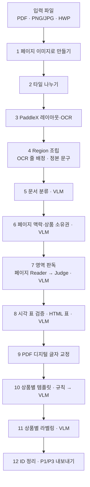

# 파싱 파이프라인 단계별 설명

main 브랜치(3d3dacb) 기준입니다. 광고 파일 하나가 들어와서 P1/P3 JSON이 나올 때까지 거치는
단계를 순서대로 설명합니다. 단계마다 **무엇을 하는지**, **어떤 규칙으로 정하는지**를 적었습니다.
VLM 호출의 프롬프트 원문과 입력은 [VLM_CALLS.md](VLM_CALLS.md)에 있습니다.

## 한눈에 보기



- **1~4단계**는 좌표와 문구 후보를 만드는 단계입니다. VLM을 쓰지 않습니다.
- **5~11단계**는 의미를 판정하는 단계로, VLM을 씁니다. 9단계(디지털 교정)만 규칙으로 돕니다.
- **좌표 원칙**: bbox는 PaddleX·OCR·PDF가 준 좌표만 씁니다. VLM에게는 좌표를 받지 않고, 문구와 ID 선택만 받습니다.
  심의 화면의 하이라이트가 원본 픽셀과 정확히 맞아야 하기 때문입니다.
- **문구 원칙**: 문구 후보(OCR, Reader, Judge, 디지털, HWP 구조)는 모두 P1에 남기고, 최종 하나만 P3로 보냅니다.
- **실패 원칙**: 조용히 지우지 않습니다. 확정하지 못한 것은 `needs_review`와 사유 코드로 표시하고 진행합니다.

---

## 1. 페이지 이미지로 만들기 — `ingest/loader.py`

모든 입력을 **페이지 이미지 + 페이지 픽셀 좌표계**로 통일합니다.

| 입력 | 처리 |
|---|---|
| PNG·JPG·JPEG | 파일 한 장이 한 페이지입니다. 디지털 텍스트가 없습니다. |
| PDF | PDFium으로 페이지마다 렌더합니다(기본 200dpi). 텍스트층이 있으면 디지털 줄(글자·좌표)도 뽑아 둡니다. |
| HWP·HWPX | ① 원본 구조를 파싱합니다(document-processor, 실패하면 Kordoc). ② 사내 렌더러(HTML → Chromium, 없으면 LibreOffice)로 PDF를 만듭니다. ③ 그 PDF를 PDF처럼 렌더하고 디지털 줄을 뽑습니다. |

**PDF 판정(triage)**: 페이지마다 텍스트층을 믿을 수 있는지 봅니다.
- `structured`: 텍스트층 신뢰
- `scan_like`: 다음 중 하나
  - 공백을 뺀 글자가 20자 이하
  - 깨진 글자(U+FFFD)가 8개 이상이고 비율이 30% 이상
  - 50자 이상인데 정상 문자 비율이 10% 이하(PUA·난독 의심)
- `hybrid`: 텍스트층은 정상이지만 이미지 면적 비율이 50% 이상

디지털 줄은 `structured`·`hybrid`에서만 뽑습니다. 판정과 무관하게 **모든 페이지가 PaddleX를 거칩니다.**
디지털 줄 추출
- 줄 소속은 PDF 내부 구조(텍스트 조각·기준선·세로 구분선)로 정합니다. 구조를 못 읽으면 글자 좌표 겹침으로 묶습니다.
- 공백은 PDF에 있는 그대로 보존합니다.

**HWP 경로**: 재구성 HTML의 문단·표 행 블록이 3개 이상이면 `hybrid` 경로로 갑니다. 구조 블록을 정본으로 쓰고,
PaddleX가 찾은 블록 중 구조와 겹치지 않는 것(이미지 속 글자 등)만 보충합니다.
구조 표 행 안에서 Paddle이 찾은 새 문구는 OCR 문구를 붙이지 않습니다. 블록 안 렌더 PDF 글자로
위치를 확인하고 그에 맞는 원본 구조 줄을 붙입니다(렌더 텍스트층은 화면 줄바꿈대로 끊기므로 문구로
쓰지 않음). 렌더 글자가 없는 이미지 속 글자만 별도 Region이 됩니다. OCR 문구는 P1 `visual_supplements`에 남습니다.
구조 블록도 디지털 텍스트도 없는 빈 페이지는 PaddleX를 생략합니다.

---

## 2. 타일 나누기 — `ocr/tiling.py`

PaddleX의 레이아웃 모델은 입력을 **800×800 정사각형으로 비율을 무시하고 눌러 넣습니다.**
그래서 세로로 긴 페이지를 통째로 보내면 작은 글자가 뭉개집니다.

- 페이지 비율(긴 변 ÷ 짧은 변)이 `PARSER_V2_ASPECT_LIMIT`(기본 2.0) 이하면 통째로 보냅니다.
- 넘으면 긴 쪽을 목표 길이 `PARSER_V2_TILE_SPAN`(기본 1600px) 조각으로 자릅니다.
  - 자르는 위치는 글자가 없는 여백 줄을 찾아 정합니다(`content_bands`). 글자 한가운데를 자르지 않기 위해서입니다.
  - 조각끼리는 조금씩 겹칩니다.
- 예: 모바일 캡처 752×7413 → 7조각. A4 PDF 1654×2339(비율 1.41) → 통짜.

---

## 3. PaddleX 레이아웃·OCR — `ocr/paddlex.py`

조각마다 PP-StructureV3 `/layout-parsing`을 1회 부릅니다. 보내는 것은 이미지와 `{"fileType": 1}`뿐이고,
임계값·모듈 설정은 서버 YAML이 정합니다. 응답 세 가지를 모두 씁니다.

| 응답 | 쓰임 |
|---|---|
| `parsing_res_list` | **Region의 시작점**. 블록 bbox, 분류명(text, table, paragraph_title, image…), 블록 본문(`block_content`) |
| `overall_ocr_res` | OCR 줄 글자와 줄 bbox |
| `layout_det_res` | 검출기 원출력(bbox·분류·점수). 진단용으로 보존만 합니다. |

조각 좌표를 원래 페이지 좌표로 옮기고, 조각 경계에서 두 번 잡힌 블록·줄을 합칩니다.
- 블록: 같은 분류 + 높은 겹침 → 합집합 bbox
- 줄: IoU 또는 작은 박스 기준 포함 비율

같은 조각 안에서 박스끼리 포함 관계인 것은 부모·자식일 수 있어서 지우지 않습니다.

---

## 4. Region 조립과 정본 문구 — `parse/adapters.py::build_page_evidence()`

PaddleX 블록 하나가 Region 하나가 됩니다(`pN_rNNN`). 그다음 **글자 줄을 Region에 배정하고 첫 정본 문구를 정합니다.**

**줄 배정**: 줄 하나는 **가장 많이 겹치는 Region 하나에만** 들어갑니다(줄 면적의 50% 이상 겹쳐야 함).
어디에도 50% 이상 안 걸리는 줄은 `unassigned_lines`로 남기고 버리지 않습니다.

**어떤 줄을 배정하는가**
- **PDF (기본 `anchor`)**: **OCR 줄만** 배정합니다. 디지털 줄은 따로 보관했다가 9단계에서 씁니다.
- **HWP 렌더 PDF, 또는 `PARSER_V2_DIGITAL_MODE=primary`**: 디지털 줄을 먼저 넣고, 디지털 줄이 50% 이상 덮는 OCR 줄은 빼고,
  나머지 OCR 줄을 보충합니다. 영역 글자의 50% 이상이 디지털이면 디지털 줄 조립본이 정본입니다.
- **깨진 텍스트층 거르기**: OCR 한글이 100자 이상인데 디지털 한글이 그 20% 미만이면, 글자 매핑이 깨진 PDF로 보고 디지털을 통째로 버립니다.

**첫 정본 문구 선택** (우선순위)
1. HWP 구조 블록이면 구조 원문
2. (primary 모드) 디지털 줄 조립본
3. PaddleX `block_content`가 영역 안의 줄을 빠뜨리면 줄 조립본. 깨진 본문이 멀쩡한 OCR 줄을 이기는 일을 막습니다.
4. 그 외에는 `block_content`

두 후보(`block_content`와 줄 조립본)의 유사도는 기록만 합니다.
- 0.8 이상: `sources_agree`
- 0.5~0.8: `minor_difference`
- 0.5 미만: `conflict_pending_vlm`

**복구 후보** (`parse/recovery.py`): 미배정 줄을 가까운 것끼리(가로는 줄 높이 1.5배, 세로는 0.25배 이내) 묶어
후보(`pN_x001`)로 만듭니다. bbox는 원래 줄의 합집합만 씁니다. 채택 여부는 6단계 VLM이 정합니다.

---

## 5. 문서 분류 (VLM) — `vlm/client.py::classify()`

첫 페이지 이미지와 파일명으로 **상품군**(예금성·대출성·카드·투자성), **광고 유형**, **상품명 노출 여부**를 받습니다.
- 파일명의 상품군 키워드는 "강한 사전확률"로 줍니다. VLM이 명확한 반대 증거로만 뒤집게 합니다.
- 어느 경로로 정했는지를 `category_source`에 남깁니다. 예: 파일명과 VLM 일치, VLM이 뒤집음, VLM 기권 후 파일명 적용.
- 이 값은 문서 기본값입니다. 상품이 여러 개인 광고는 6단계에서 상품별로 다시 판정합니다.

---

## 6. 페이지 맥락·상품 소유권 (VLM) — `parse/semantic.py::analyze_page_context()`

페이지 이미지에 Region(파랑)·복구 후보(주황) 박스와 ID를 그려 주고, Region 목록(ID·bbox·분류명·문구)과 함께
**한 번에** 다섯 가지를 받습니다. 라벨은 여기서 붙이지 않습니다.
1. 상품 목록(product_1…)과 상품별 상품군·상품명 노출 여부
2. Region마다 소속: `product_N` / `page_common`(회사명·심의번호·광고 전체 유의사항) / `unknown`
3. 복구 후보 처리: 새 Region / 기존 Region의 설명으로 붙이기 / 공통 / 장식 / 확정 불가
4. PaddleX가 놓친 표 후보 (Region ID 묶음)
5. 목록에 없는데 이미지에 보이는 문구

**규칙**
- 긴 페이지(2단계에서 나눈 페이지)는 2~4개 밴드로 나눠 밴드마다 부르고 결과를 합칩니다. product_1은 문서 전체에서 같은 ID입니다.
- 모르는 ID와 중복은 버리고, 빠진 ID는 `unknown`으로 채웁니다.
- 검수 사유
  - 소유권 확신도 0.7 미만: `ownership_low_confidence`
  - 소속이 `unknown`: `ownership_unknown`
  - 복구 후보 처리가 `needs_review`이거나 확신도 0.7 미만: `recovery_action_uncertain` / `recovery_low_confidence`
- 채택된 복구 후보는 `pN_x…` Region이 됩니다. 장식으로 판정된 후보는 문구에서 빠지지만 기록은 남습니다.

**HWP 추가 처리**: 구조 파서가 준 원본 표 셀은 해당 Region에 `kind=table`로 붙입니다(`_place_tables`).
구조 문단·표를 렌더 Region 문구에 대조해 연결합니다(`align_hwp_structure`).
이 표는 7·8단계에서 다시 읽지 않습니다.

> 이 단계의 판단(상품 배정, 표 후보)은 **같은 입력에서도 실행마다 흔들릴 수 있습니다.** 온도를 0으로 해도 마찬가지입니다.
> 실측: 4.카드 r018의 상품 배정, 25.대출의 표 묶음이 실행마다 달랐습니다.

---

## 7. 영역 판독 (VLM) — `parse/reading.py::read_page()`

OCR 문구를 이미지로 다시 확인해 **최종 문구**를 정합니다. 대상은 표가 아닌 모든 Region입니다.
HWP 원본 구조 표와 구조 원문 Region은 제외합니다.

**① 페이지 Reader** (기본): 원본 페이지 + ID 박스를 그린 페이지, 두 장과 Region ID·bbox 목록을 주고
최대 20개 Region(OCR 글자 합계 2,400자)씩 한 번에 전사시킵니다.
- **OCR 문구는 주지 않습니다.** 주면 그대로 베껴 쓰는 경우가 있어서 독립 판독이 되지 않습니다.
- 긴 페이지는 6단계와 같은 밴드로 자릅니다.

**② 빠진 것만 crop으로 다시 읽기**
- 묶음 호출이 실패해 결과가 없는 Region → Region만 잘라(bbox 밖은 흰색, 작으면 최대 4배 확대) 다시 읽습니다.
- 판독이 비었는데 OCR에 글자·숫자가 4자 이상인 Region → 같은 방식으로 다시 읽습니다.

**③ Judge 호출 조건**: 판독이 비지 않았고, OCR 문구와 공백·기호를 뺀 **글자·숫자가 한 자라도 다르면** 부릅니다.
Region crop 이미지와 두 후보(출처는 숨김)를 주고 이미지 기준 최종 문구를 받습니다.
띄어쓰기·줄바꿈·글머리 기호만 다르면 부르지 않습니다.

**④ 최종 문구 선택** (`apply_reading`)
| 상황 | 최종 문구 | 표시 |
|---|---|---|
| 판독이 빔 | OCR 문구 유지 | `vlm_blank` |
| HWP 구조와 일치하는 Region | 구조 원문 보존 | `parser_verified_by_hwp_structure` |
| Judge 결과 있음 | Judge 문구 | `judge_selected`. 확신도가 0.7 미만이면 `vlm_judge_low_confidence` |
| Judge 없음, 두 후보 같음 | Reader 문구 | `agree` |
| Judge 실패, 두 후보 다름 | Reader 문구 | `ocr_vlm_disagreement` |
| OCR이 비어 있었음 | Reader 문구 | `vlm_only_text` |
| Reader 호출 실패 | OCR 문구 유지 | `vlm_read_failed` |

Region 하나의 실패가 페이지를 멈추지 않습니다. 페이지 Reader가 통째로 실패해도 모든 Region을 crop으로 다시 읽습니다.

---

## 8. 시각 표 검증과 표 문구 (VLM) — `parse/visual_tables.py`

**① 후보 모으기**: PaddleX가 `table`로 분류한 Region 하나씩, 그리고 6단계 VLM이 지목한 ID 묶음입니다.

**② 검증 (VLM)**: 페이지 전체(후보 빨간 박스)와 확대 이미지(구성 Region 파란 박스)를 주고
"하나의 심의 항목에 속하는 표인가, 포함할 ID는?"을 묻습니다. 다음 조건을 **모두** 만족할 때만 표로 확정합니다.
- 확신도 0.7 이상
- 구성 Region의 상품 소유권이 하나
- HWP 원본 표와 겹치지 않음
- 다른 Region과 같은 본문을 이중으로 담지 않음

`대출대상 | 대출한도 | 대출기간`처럼 서로 다른 심의 항목을 나열한 것은 표로 묶지 않게 지시합니다.

**③ 합치기**: 확정된 Region들을 bbox 합집합 하나로 합치고 `kind=table`로 표시합니다. 원래 Region 기록은 P1에 남습니다.

**④ 표 문구 (HTML, 기본)**: 표 crop을 VLM에 주고 HTML(`rowspan`/`colspan`)로 받습니다. 코드가 두 가지를 검사합니다.
- 병합을 푼 격자에서 모든 행의 칸 수가 같고 빈 자리가 없는가
- 원래 문구 글자의 85% 이상이 들어 있는가

통과하면 **GFM 마크다운 표**를 문구로 씁니다. 실패하면 이유를 알려 한 번 더 묻고, 두 번 모두 실패하면
`table_html_invalid`를 붙이고 이전 방식(표 Judge의 `항목 | 값` 줄 나열)으로 되돌립니다.
- 예: 본문 전체가 표 블록 하나로 잡힌 경우, HTML은 안쪽 표만 뽑아 포함률이 33%에 그쳐 되돌아갔습니다.

---

## 9. PDF 디지털 글자 교정 (규칙) — `parse/digital_anchor.py`

PDF 텍스트층의 **글자**는 정확하지만, 좌표 순서로 이어 붙이면 순서·띄어쓰기·글머리 기호가 틀어집니다.
그래서 문장의 틀은 7·8단계의 VLM 문구를 따르고, 디지털에서는 글자만 가져와 고칩니다.
**PDF 입력에만** 적용합니다. HWP는 4단계에서 이미 디지털이 정본이고, 이미지는 디지털이 없습니다.

Region마다 bbox를 16px 넓힌 범위에 30% 이상 걸친 디지털 줄을 "근처 줄"로 모으고, 세 단계를 거칩니다.

1. **낱말 교정**: VLM 문구의 한글 낱말(4자 이상)이 근처 디지털 글자와 거의 같으면 디지털 글자로 바꿉니다.
   - 허용 차이: 편집 거리 `길이 ÷ 4` 이하. 후보가 여럿이면 기호 없이 이어진 디지털 낱말과 정확히 같은 쪽을 고르고, 그래도 같으면 바꾸지 않습니다.
   - 숫자는 형식(자릿수·점 위치)이 같고 한 자리만 다른 유일한 짝일 때만 바꿉니다.
   - 예: `대출시청`→`대출신청`, `농업전문교육이수자`→`농어업…`, `변동의서`→`번동의서`
2. **문장 정렬**: VLM 문구와 근처 디지털 글자열을 나란히 맞추고, **양옆 3자 이상이 일치하는 사이의 6자 이하 차이**만 디지털로 메웁니다.
   - 중간에 넣기: 숫자 없는 2자 이하만 (`시1)`→`시주1)`, `되는`→`되려는`)
   - 끝에 붙이기: 이 Region 소속 줄의 글자만 (`최고 1.50%p`→`최고 1.50%p (①+②)`)
   - 지우기: 한글 3자 이하만 (`자동으로 이체`→`자동이체`)
   - 표 구분자(`|`)·줄바꿈을 걸친 차이, 글머리 기호만 다른 차이(`•`↔`ㆍ`)는 두지 않습니다.
3. **줄 확인**
   - 이 Region 소속(4단계와 같은 50% 규칙) 디지털 줄이 **페이지 어디에도 없으면** 세로 위치에 맞춰 끼워 넣고 `digital_text_inserted`를 붙입니다.
   - 박스 **밖**에 바로 붙은 옆 Region의 줄이 이 문구에 통째로 있으면 `neighbor_line_duplicated`를 붙입니다.
   - 앞뒤 낱말은 디지털과 맞는데 그 낱말만 디지털에 없으면 `vlm_not_in_digital`을 붙입니다. 로고처럼 줄 전체가 디지털에 없는 글자는 제외합니다.

깨진 문자열·PUA·제어문자는 문구에 들어가지 않습니다. 고친 내역은 P1 Region의 `digital_anchor`에 남습니다.
이전 방식(`PARSER_V2_DIGITAL_MODE=primary`)은 이 단계 없이 4단계의 디지털 정본을 그대로 씁니다.
그 경우 7단계에서 VLM이 다르게 읽으면 `digital_text_vlm_disagreement`만 붙습니다.

---

## 10. 상품별 템플릿 (규칙 → VLM) — `parse/templates.py`, `review/resolution.py`

카탈로그(`nh_parser_fin/templates/ad_templates.json`)의 **19개 광고 템플릿** 중 상품마다 하나를 고릅니다.
템플릿이 정해지면 그 템플릿의 **구분값 목록이 곧 라벨 후보**가 됩니다.

1. **상품군·상품명 노출**: 6단계의 상품별 값을 쓰고, 없으면 문서 분류 값을 씁니다.
   상품명이 실제 그 상품 Region 문구에 있으면 노출 여부를 `노출`로 교정합니다.
2. **규칙**: 상품군으로 후보를 좁힌 뒤, 문구 키워드와 노출 여부로 정합니다.
   - 대출: 대출모집인 / 상품명 노출·미노출
   - 예금: 미노출 / 지수연동·적립식·거치식·입출식 중 키워드가 하나만 나올 때
   - 카드: 카드론 / 법인·개인 / 미노출
   - 투자: ISA 신탁·일임 / IRP / 퇴직연금 / 펀드
3. **VLM**: 규칙으로 못 정하고 후보가 둘 이상일 때만 부릅니다. **이미지 없이** 파일명·사전 분류·후보 템플릿의 구분값 목록·
   그 상품 Region의 줄 원문을 줍니다. 판단불가면 `template_unresolved`를 붙이고 라벨링을 건너뜁니다.
4. **공통·미상 영역**
   - `page_common`: 상품이 하나면 그 상품 템플릿 + 공통 구분값, 여러 개면 19종 공통 구분값(회사명·유의사항·심의번호)만 씁니다.
   - `unknown`: 문서에 나온 모든 템플릿 구분값의 합집합을 씁니다.

---

## 11. 상품별 라벨링 (규칙 + VLM) — `parse/pipeline.py::_label_pages()`

한 Region에 **해당하는 구분값을 모두** 붙입니다(여러 개 가능). 상품이 섞이지 않도록 **상품별로 따로** 부릅니다.

1. **결정론 표제어**: 줄 시작에 `가입대상`, `가입자격`, `기본금리`, `이자지급방식` 같은 표제어(별칭 포함)가 있으면
   코드가 먼저 찾아 둡니다. 문장 중간의 언급은 잡지 않습니다.
2. **VLM**: 15개씩 묶어 두 이미지(페이지 + ID 박스, Region 확대 시트)와 목록을 줍니다.
   - 목록: ID·bbox·결정론 표제어·**최종 문구**
   - 허용 라벨마다 **정의, 긍정 예시(템플릿 카탈로그에서 최대 2개), 부정 예시**를 함께 줍니다.
   - Region마다 라벨과 **원문에서 그대로 복사한 근거 문구**를 받습니다.
3. **검증·보완·제약** (코드)
   - 근거 문구가 Region 최종 문구에 **실제로 없으면 그 라벨을 버립니다.**
   - 라벨을 붙이고 사유에 "해당없음"이라고 쓴 모순 응답은 지웁니다.
   - 결정론 표제어 라벨은 VLM이 빠뜨려도 붙입니다.
   - 짧은 제목 Region(60자 이하, 제목 분류)은 `상품명`만 남깁니다.
   - 금리 산정 예시(기준·가산·우대금리 설명)는 `대출금리`와 명시적 표제어만 남깁니다.
   - 라벨 확신도가 0.7 미만이면 `label_low_confidence`를 붙입니다. 라벨이 없는 것 자체는 검수 사유가 아닙니다.

---

## 12. ID 정리와 내보내기 — `parse/ids.py`, `parse/export.py`

**읽기 순서**: PaddleX의 블록 순서를 유지합니다. 단순 위→아래 정렬은 2단 광고의 좌우를 섞기 때문입니다.
기존 Region의 설명으로 붙은 복구 Region만 대상 바로 뒤로 옮깁니다.

**ID 정규화**: 모든 판단이 끝난 뒤 배열 순서대로 `pN_r001`부터 다시 번호를 붙입니다. 복구 Region(`pN_x…`)도 여기서 `r`로 바뀝니다.
부모·자식, 표 구성원 참조도 함께 바꾸고, 원래 ID는 P1의 `source_region_id`·`region_id_map`에 남깁니다.

**P1** `nh-ad-parse-evidence-v6`: 재현·원인 분석용 원장입니다. 모든 관측과 후보, 판정 근거를 담습니다.
- OCR·디지털 줄과 좌표, HWP 구조 근거
- VLM 소유권·판독·Judge·표·라벨 판정과 근거
- 디지털 교정 내역(`digital_anchor`), 표 격자(`visual_table`)
- `needs_review` 사유

**P3** `nh-ad-region-review-input-v11`: 심의 입력입니다. Region마다 아래 필드만 담습니다.

| 필드 | 뜻 |
|---|---|
| `region_id` | `pN_rNNN`, 심의 결과가 근거로 돌려줄 ID |
| `product_id` | `product_N` / `page_common` / `unknown` |
| `bbox` | 페이지 픽셀 좌표 `[x0, y0, x1, y1]` |
| `selected_text` | 최종 문구. 확인된 시각 표는 마크다운 표(실패 시 `항목 \| 값` 줄 나열) |
| `labels` | 구분값 목록 |
| `kind` | `text` / `table` |
| `needs_review` | 파싱 품질 확인이 필요한가 (위반 여부가 아님) |
| `text_source` | `hwp` / `digital` / `ocr` / `vlm` |
| `table` | 표 Region만. `table_id`, `source`(`hwp`/`vlm`), `cells`(행·열·병합·머리 여부·문구, HWP는 셀 `bbox`), `row_texts`, HWP 중첩 표 행은 `row`·`context` |

페이지에는 `tables` 색인(`table_id`, 행·열 수, 머리 행 수, `header_source`, `region_ids`)이 붙고, 문서에는 `review_units`(상품별 템플릿·허용 라벨·Region ID 묶음)가 붙습니다.

---

## 검수 사유 코드 (`needs_review`)

`needs_review`는 광고 위반이 아니라 **파싱 결과를 사람이 확인해야 한다**는 신호입니다.

| 단계 | 사유 | 뜻 |
|---|---|---|
| 6 | `ownership_unknown` / `ownership_low_confidence` | 상품 소속 미확정 / 확신도 0.7 미만 |
| 6 | `recovery_action_uncertain` / `recovery_low_confidence` | 복구 후보 처리 불확실 |
| 7 | `vlm_read_failed` | 판독 호출 실패, OCR 문구 유지 |
| 7 | `ocr_vlm_disagreement` | OCR·Reader가 다르고 Judge 결과 없음 |
| 7 | `vlm_judge_low_confidence` | Judge 확신도 0.7 미만 |
| 7 | `vlm_only_text` | OCR이 없고 VLM만 읽음 |
| 8 | `table_verification_failed` / `table_region_overlap` / `table_text_missing` | 표 검증 실패·중복·문구 없음 |
| 8 | `table_html_invalid` | HTML 격자 무효, `항목 \| 값` 줄 나열로 되돌림 |
| 8 | `table_vlm_read_failed` / `table_vlm_read_low_confidence` / `table_vlm_read_blank` | 표 Judge 실패·저신뢰·빈 응답 |
| 9 | `digital_text_inserted` | 빠진 디지털 줄을 끼워 넣음 |
| 9 | `vlm_not_in_digital` | 디지털에 없는 낱말 |
| 9 | `neighbor_line_duplicated` | 박스 밖 옆 Region 줄이 들어옴 |
| 10 | `template_unresolved` | 템플릿 미확정, 라벨링 보류 |
| 11 | `label_low_confidence` | 라벨 확신도 0.7 미만 |
| HWP | `hwp_structure_page_unmatched` | 구조 노드가 이 페이지 Region과 대응하지 않음 |

권장 확인 순서
1. 소유권·템플릿: 틀리면 라벨 전체가 연쇄로 틀립니다.
2. 문구: 빠진 줄, 디지털에 없는 낱말, 판독 불일치. 숫자·금리·날짜를 먼저 봅니다.
3. 표
4. 라벨

---

## 설정으로 바꿀 수 있는 것

| 변수 | 기본 | 다른 값 |
|---|---|---|
| `PARSER_V2_DIGITAL_MODE` | `anchor` (9단계 교정) | `primary` 디지털 정본(이전 방식), `off` 사용 안 함 |
| `PARSER_V2_READER_MODE` | `page` | `region` Region마다 crop Reader |
| `PARSER_V2_PAGE_READER_TEXT` | `off` | `on` 페이지 Reader에 OCR 문구 전달 |
| `PARSER_V2_JUDGE_TRIGGER` | `strict` | `ratio` 일치도 0.95 미만일 때만 |
| `PARSER_V2_JUDGE_PROMPT` | `blind` | `default` 후보 출처 공개 |
| `PARSER_V2_TABLE_FORMAT` | `html` | `pipe` `항목 \| 값` 줄 나열만 |
| `PARSER_V2_REVIEW_RULES` | `default` | `ocr` 디지털 없이 판독 품질 검수 사유 추가(오탐 많음) |
| `PARSER_V2_READING_SCOPE` | `all` | `targeted` 의심 영역만, `off` 판독 생략 |
| `PARSER_V2_ASPECT_LIMIT` / `PARSER_V2_TILE_SPAN` | 2.0 / 1600 | 타일링 기준 |

이전 방식 전체로 되돌리려면 다음 한 줄을 씁니다.
```
PARSER_V2_DIGITAL_MODE=primary PARSER_V2_READER_MODE=region PARSER_V2_JUDGE_TRIGGER=ratio PARSER_V2_JUDGE_PROMPT=default PARSER_V2_TABLE_FORMAT=pipe
```
